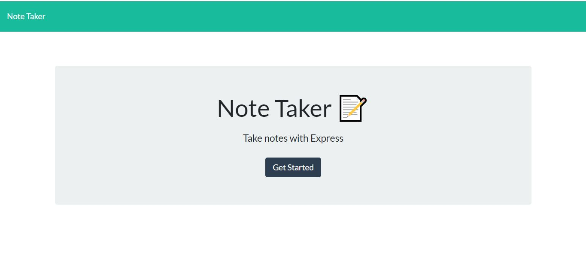
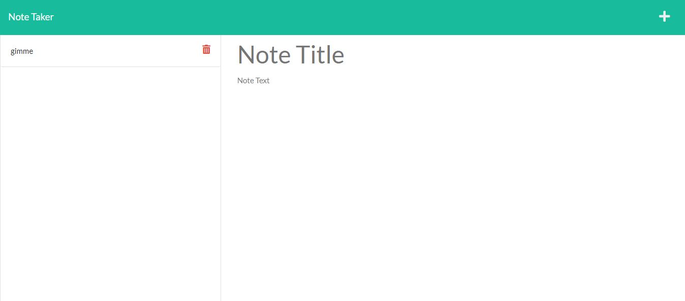
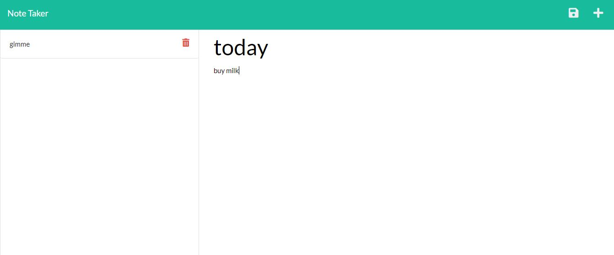

# note-taker

Link to deployed website:

https://damp-temple-36265.herokuapp.com/

Note Taker is a program that allows one to add, edit or delete notes.

The user is initially presented to the main homepage for Note Taker and there is a "Get Started" button that will redirect the user to another website where notes can be created, deleted or edited

This was created using HTML, CSS, Bootstrap, Javascript and Express.js framework.

Javascript was used to add the functional logic of allowing users to add/edit/delete notes.

Express.js framework is implemented to connect the frontend to backend framework, create a GET, POST, and DELETE requests to either retrieve all notes from the database, send note data to the database, or to delete a specific note based off it's id, and also used to deploy the full stack website through Heroku.

# Screenshots

This is the main home page where the user is give the option to enter notes by clicking on the "Get Started" button.

After clicking on "Get Started", the user is redirected to the notes webpage where the user can enter the title and description of the note to be added.

The user can also see previous notes and delete them by clicking on the red trash can button.

Only when the user types content on both the note title and description sections does the user see the "Save icon" button on the top right.

When clicked, the note gets saved and gets added on the left hand column. The user can see previous note information by simply clicking on any note on the left hand column.

Clicking on the "Plus" icon on the top left allows the user to create a new note.

